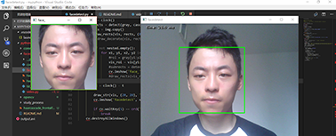
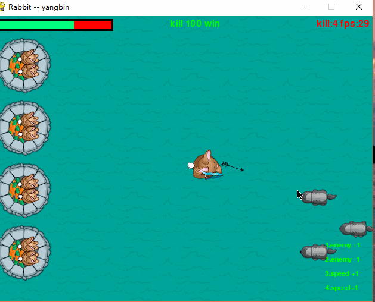

python-study
-------------
python 小玩意

## study_process
* 分布式进程


## facedetect
* 人脸监测
>环境 `python3.5`  <br/>
>依赖`opencv-python` cv2 安装方式 `pip install opencv-python`<br/>
>`facedetec.py` 中的配置文件地址需要改成本地的目录下面<br/>
```python
cascade_fn = args.get('--cascade',r"D:\mycode\mypython\python-study\facedetect\haarcascade_frontalface_default.xml")
nested_fn  = args.get('--nested-cascade', r"D:\mycode\mypython\python-study\facedetect\haarcascade_eye.xml")
```
运行`facedetec.py`
效果如下<br/>
  


## game_rabbit
* 射击小游戏  


  


