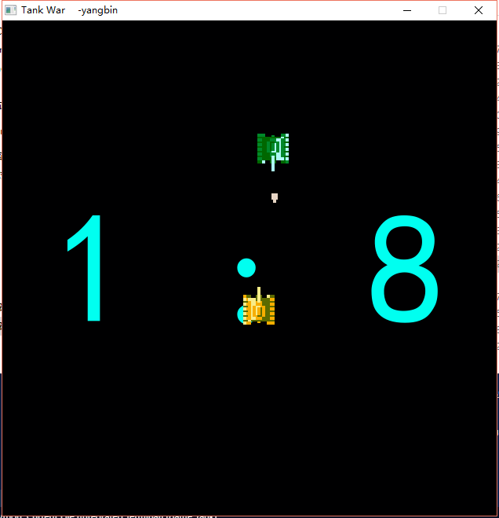

python AI 坦克
---------------------
玩家操控坦克击败AI操控的坦克  

* pygame
* (打包)pyinstaller.exe -D -w  .\main.py -p . -i .\index.ico -n tankwar
* AI算法:
```python
    def AI(self,bullet,tank,tanksGroup,Gunfire_sound):
        # bullet: 敌方子弹,敌方坦克,坦克群,音效
        pass
        # 判断是否收到子弹袭击
        tx = tank.rect.x
        ty = tank.rect.y

        sx = self.rect.x
        sy = self.rect.y

        distx = sx - tx
        disty = sy - ty

        bx = bullet.rect.x
        by = bullet.rect.y
        
        sbx = sx - bx
        sby = sy - by
        # 如果敌人发射炮弹  躲避攻击
        if bullet.being:
            # y 方向受到攻击
            if sbx < 20 and sbx > -48:
                if sbx < -34:
                    self.track = 1
                else:
                    self.track = 2
            # x 反向收到攻击
            elif sby < 20 and sby > -48:
                if sby < -34:
                    self.track = 3
                else:
                    self.track = 4
            
        else:
            # 目标位置
            # 距离目标哪个轴距最短, 向哪个方向移动
            if abs(disty) < abs(distx):
                if disty > 20:
                    self.track = 3
                elif disty < -20:
                    self.track = 4        
            else:
                if distx > 20:
                    self.track = 1
                elif distx < -20:
                    self.track = 2

            # 计算目标方向 发射炮弹
            if abs(disty) <= 24:
                if distx > 0:
                    self.track = 1
                else:
                    self.track = 2
                self.is_shoot = True
            elif abs(distx) <= 24:
                if disty > 0:
                    self.track = 3
                else:
                    self.track = 4
                self.is_shoot = True

        if self.track == 1:
            self.move_left(tanksGroup)
        elif self.track == 2:
            self.move_right(tanksGroup)
        elif self.track == 3:
            self.move_up(tanksGroup)
        elif self.track == 4:
            self.move_down(tanksGroup)
        
        if self.is_shoot:
            if not self.bullet.being:
                self.shoot()
                Gunfire_sound.play()
            self.is_shoot = False
```

